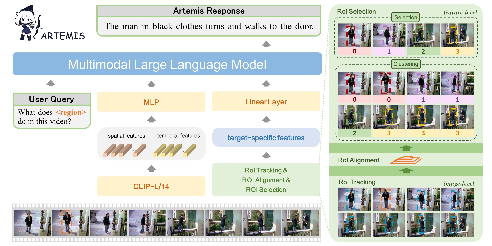

<p align="center">
  <a href="#">
</a>
  <h1 align="center"><font color="#00003d">Artemis</font></h1>
</p>


<h3>Artemis: Towards Referential Understanding in Complex Videos </h3>


## Abstract

Videos carry rich visual information including object description, action, interaction, etc., but the existing multimodal large language models (MLLMs) fell short in referential understanding scenarios such as video-based referring. In this paper, we present Artemis, an MLLM that pushes video-based referential understanding to a finer level. Given a video, Artemis receives a natural-language question with a bounding box in any video frame and describes the referred target in the entire video. The key to achieving this goal lies in extracting compact, target-specific video features, where we set a solid baseline by tracking and selecting spatiotemporal features from the video. We train Artemis on the newly established VideoRef45K dataset with 45K video-QA pairs and design a computationally efficient, three-stage training procedure. Results are promising both quantitatively and qualitatively. Additionally, we show that Artemis can be integrated with video grounding and text summarization tools to understand more complex scenarios.


## Overview

<p align="center">
    </a> <br>
    The architecture detail of the Artemis model. 
</p>


## Install

1. Clone this repository and navigate to Artemis folder

```bash
git clone https://github.com/NeurIPS24Artemis/Artemis.git
cd Artemis
```

2. Install Packages

```Shell
conda create -n artemis python=3.11 
conda activate artemis
pip install --upgrade pip  # enable PEP 660 support
pip install -e .
pip install -e ".[train]"
pip install flash-attn --no-build-isolation
pip install decord opencv-python
pip install torch-kmeans
pip install pycocoevalcap
# cuda 11.7
cd mmcv-1.4.7/
MMCV_WITH_OPS=1 pip install -e .
```

## Training & Validating

The training & validating instruction is in [TRAIN_AND_VALIDATE.md](./TRAIN_AND_VALIDATE.md).


## Acknowledgment

This project is based on Video LLaVA ([paper](https://arxiv.org/abs/2311.10122), [code](https://github.com/PKU-YuanGroup/Video-LLaVA)), LLaVA ([paper](https://arxiv.org/abs/2304.08485), [code](https://github.com/haotian-liu/LLaVA)),  GPT4RoI ([paper](https://arxiv.org/abs/2307.03601), [code](https://github.com/jshilong/GPT4RoI)), Video-ChatGPT([paper](https://arxiv.org/abs/2306.05424), [code](https://github.com/mbzuai-oryx/Video-ChatGPT)), thanks for their excellent works.
